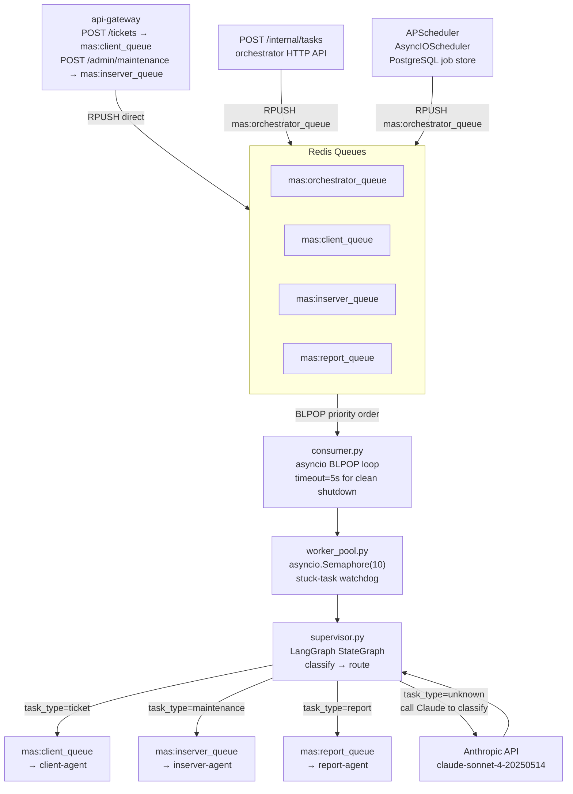
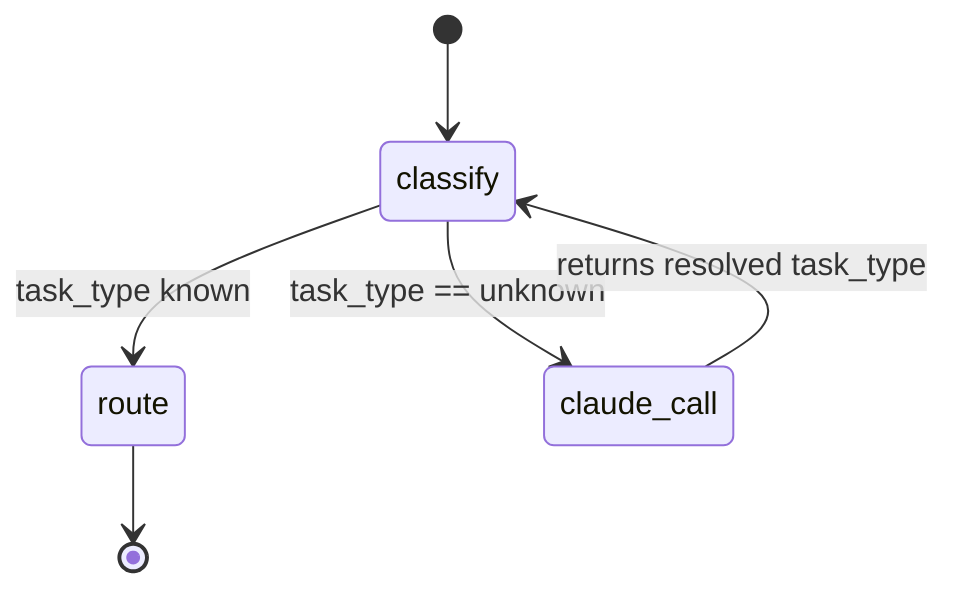
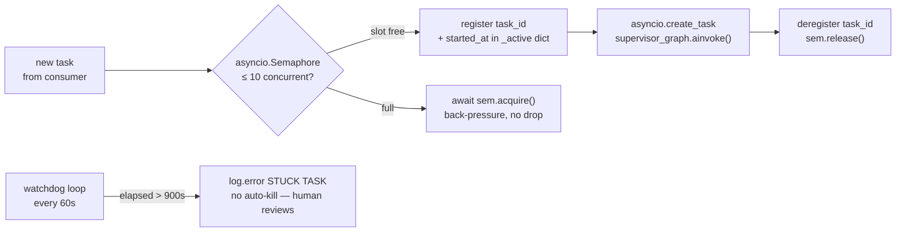

# Agent Orchestrator

> The central nervous system of SentinelMAS — receives every task, decides who handles it, and ensures nothing gets lost or stuck.

**Port:** `8001` | **Phase:** 4 | **Stack:** FastAPI · LangGraph · Redis · APScheduler · PostgreSQL

---

## For Business Stakeholders

### What does this service do?

Think of the orchestrator as the operations manager of an automated workforce.

When a customer submits a support ticket, or when the nightly server check kicks off, or when the weekly report is due — it all flows through here first. The orchestrator decides which specialist agent is best suited for the job, sends them the work, and keeps an eye on progress.

It does not do the actual work itself. Its job is to make sure work reaches the right place, at the right time, without anything falling through the cracks.

### How does it keep things reliable?

**Nothing is lost — ever.**
Every task sits in a Redis queue until an agent picks it up. If a container restarts mid-task, the task stays in the queue and is picked up again. There is no in-memory state that could vanish.

**Nothing runs forever.**
A watchdog timer checks every 60 seconds. If any task is still running after 15 minutes without completing, the orchestrator logs an alert and flags it for human review.

**Work runs on schedule automatically.**
No one has to remember to run the nightly server health checks or the Monday morning report. The scheduler handles it — even if the team is asleep.

**It scales with demand.**
During a high-ticket period, more orchestrator containers can be added. They all share the same queue, so work distributes automatically without any configuration changes.

### Scheduled work

| Task | When | What happens |
|---|---|---|
| Daily server check | Every night at 00:05 UTC | Every active server gets a health inspection automatically |
| Weekly report | Every Monday at 06:00 UTC | A summary of the week's incidents, costs, and server status is generated and sent |
| Hourly monitoring | Every hour | Internal system health is logged and verified |

### What is your money buying here?

Without this service, agents would need to be manually triggered, tasks could be lost if a container crashed, and there would be no automated scheduling. This service is what turns a collection of individual AI tools into a coordinated, always-on operations team.

---

## For Senior Engineers

### Architecture overview

The orchestrator implements a **fan-out task routing pattern** over Redis queues, wrapped in a LangGraph supervisor graph for intelligent classification of ambiguous tasks.



### LangGraph supervisor graph

The supervisor graph is a two-node `StateGraph` operating on `AgentState`:



**`classify` node:** If `task_type` is `ticket | maintenance | report`, returns unchanged. If `unknown`, sends a prompt to Claude asking for classification and parses the JSON response. Falls back to `ticket` on parse error.

**`route` node:** RPUSHes the serialised `AgentState` to the appropriate specialist queue. Updates `tickets.status = 'assigned'` in Postgres if `ticket_id` is present. Returns `assigned_agent` and updated `status`.

### Worker pool design



**Why no auto-kill?** A stuck task may be executing an SSH command on a live server. Force-killing it could leave the server in a half-applied state. The watchdog alerts; a human decides whether to intervene.

### Queue BLPOP priority

```
mas:orchestrator_queue  ← checked first (HTTP intake, scheduler)
mas:client_queue        ← second (direct gateway push for tickets)
mas:inserver_queue      ← third (direct gateway push for maintenance)
mas:report_queue        ← fourth (scheduler push for reports)
```

Redis BLPOP returns the first non-empty key from left to right. This gives the orchestrator queue priority — tasks routed through the HTTP API or scheduler bypass the direct-push queues and are processed first.

### AgentState — field reference

Defined in `state.py`. All agent services use a compatible copy of this TypedDict.

| Field | Type | Set by | Purpose |
|---|---|---|---|
| `task_id` | str | consumer | UUID per task |
| `trace_id` | str | consumer | Langfuse trace ID |
| `task_type` | Literal | gateway/scheduler | ticket / maintenance / report / unknown |
| `assigned_agent` | Optional[str] | route node | Which agent handles this |
| `severity` | Optional[Literal] | client-agent | LOW/MEDIUM/HIGH/CRITICAL |
| `ticket_id` | Optional[str] | gateway | Links to `tickets.id` |
| `user_message` | Optional[str] | gateway | Raw ticket text |
| `server_id` | Optional[str] | gateway/scheduler | SSH target server |
| `rag_hits` | list[dict] | client-agent | RAG retrieval results |
| `web_search_results` | list[dict] | client-agent | Tavily results |
| `action_plan` | list[str] | client-agent | Ordered fix steps |
| `execution_log` | list[dict] | client-agent | SSH command results |
| `status` | Literal | supervisor/agents | State machine position |
| `resolution_summary` | Optional[str] | client-agent | Plain-language answer |
| `error` | Optional[str] | any node | Failure message |
| `created_at` | datetime | consumer | Task birth |
| `updated_at` | datetime | each node | Last mutation |

### APScheduler setup

```
Scheduler type:  AsyncIOScheduler (runs in same event loop as FastAPI/consumer)
Executor:        AsyncIOExecutor (jobs are async functions)
Job store:       SQLAlchemyJobStore → PostgreSQL table apscheduler_jobs
                 (survives container restarts — jobs re-registered on startup with replace_existing=True)
```

**Why PostgreSQL job store?**
An in-memory job store loses all scheduled job state on container restart. With the PostgreSQL store, scheduled jobs survive a full stack restart. `replace_existing=True` ensures re-registration on startup doesn't create duplicate jobs.

### Langfuse tracing

The `langfuse_tracer.py` module wraps every Claude API call made by the supervisor with a Langfuse trace. It degrades gracefully:

- `LANGFUSE_PUBLIC_KEY` not set → `_NoOpTrace` stub returned — zero overhead, zero errors
- Langfuse unreachable → exception caught and logged — agent continues
- Langfuse healthy → full trace with token counts, model, task metadata

This design ensures Langfuse is never on the critical path.

### Internal API

| Method | Path | Auth | Caller |
|---|---|---|---|
| `POST` | `/internal/tasks` | X-Internal-Key | api-gateway, admin tools |
| `PUT` | `/internal/tasks/{id}/status` | X-Internal-Key | specialist agents (Phase 5–7) |
| `GET` | `/ops/agents` | none | ops dashboard |
| `GET` | `/ops/queue` | none | ops dashboard, Prometheus |
| `GET` | `/health` | none | Docker healthcheck |

### Startup sequence

1. Async SQLAlchemy engine + `async_sessionmaker`
2. Redis connection (`aioredis.from_url`)
3. `init_pool()` → `pool.start()` (watchdog task)
4. `langfuse_tracer.init_tracer()` (no-op if keys absent)
5. `AsyncIOScheduler.start()` + `register_jobs()` (3 cron triggers)
6. `asyncio.create_task(run_consumer(...))` — consumer starts in background
7. FastAPI begins accepting requests

Single Uvicorn worker (`--workers 1`) is intentional: the consumer loop and APScheduler must share the same asyncio event loop. Horizontal scaling is at the container level.

### Failure modes and recovery

| Failure | Behaviour |
|---|---|
| Redis down at startup | BLPOP raises; consumer retries with 5 s backoff |
| Postgres down at startup | APScheduler job store init fails; service won't start — fix: check DB health |
| Claude API timeout during classify | Falls back to `task_type=ticket`; logs warning |
| Task stuck > 15 min | Watchdog logs error; no auto-kill |
| Container restart mid-task | Task remains in Redis queue (BLPOP atomicity); re-processed after restart |

### Design references

- `systemdev_docs/SYSTEM_DESIGN.md §2.2` — orchestrator architecture
- `systemdev_docs/AGENT_DESIGN.md §2` — `AgentState` TypedDict canonical spec
- `systemdev_docs/AGENT_DESIGN.md §1.1` — supervisor system prompt
- `services/agent-orchestrator/dev_note.md` — function-level documentation
