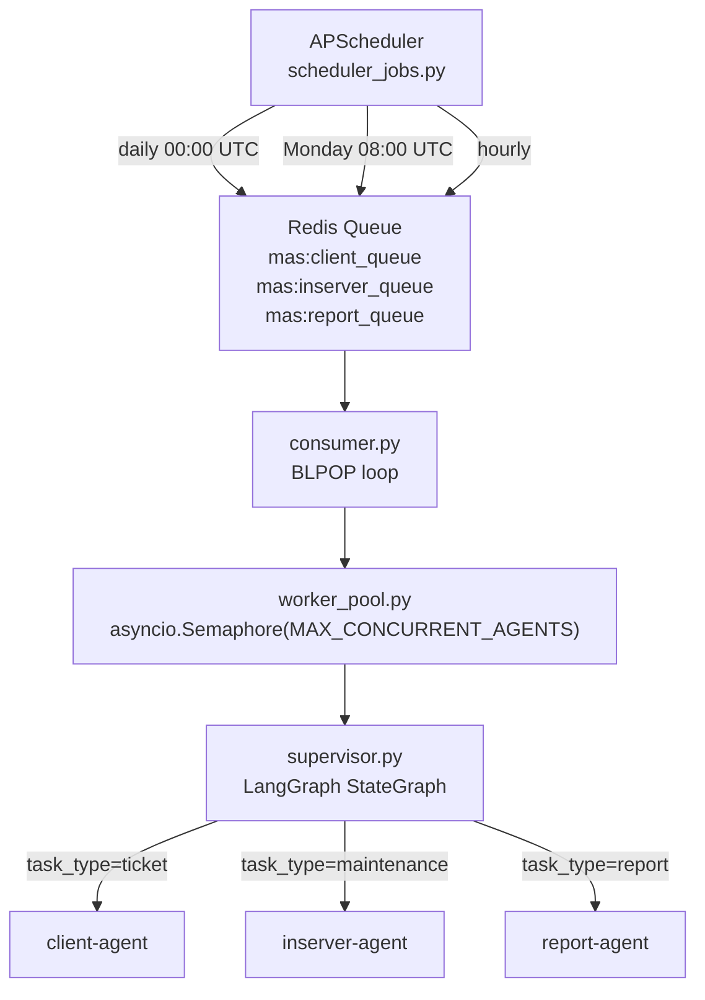

# Agent Orchestrator

LangGraph supervisor that consumes the Redis task queue, routes tasks to specialist agents, and manages the APScheduler cron jobs.

**Port:** `8001` | **Built in:** Phase 4 | **Status:** scaffold

---

## How It Works

## Concurrency Model

- One `consumer.py` BLPOP loop per container
- `asyncio.Semaphore(MAX_CONCURRENT_AGENTS)` caps parallel agent invocations
- Stuck-task watchdog: agent in `executing` state > 15 min → escalate + alert
- Scale horizontally: add containers — they share the same Redis queue

## Scheduled Jobs

| Job | Schedule | Action |
|---|---|---|
| `daily_inserver_check` | 00:00 UTC daily | Enqueue maintenance task for all active servers |
| `weekly_report` | Monday 08:00 UTC | Enqueue report generation |
| `hourly_cache_cleanup` | Every hour | Clear expired Redis entries |

## Design References
- `systemdev_docs/SYSTEM_DESIGN.md §2.2` — orchestrator architecture
- `systemdev_docs/AGENT_DESIGN.md §2` — `AgentState` TypedDict (defined here, used by all agents)
- `services/agent-orchestrator/dev_note.md` — full `AgentState` field table
