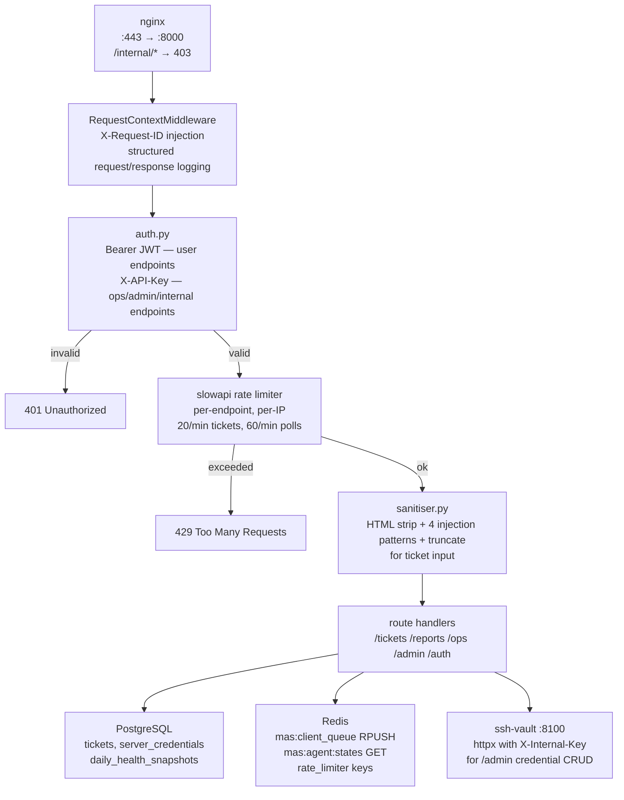
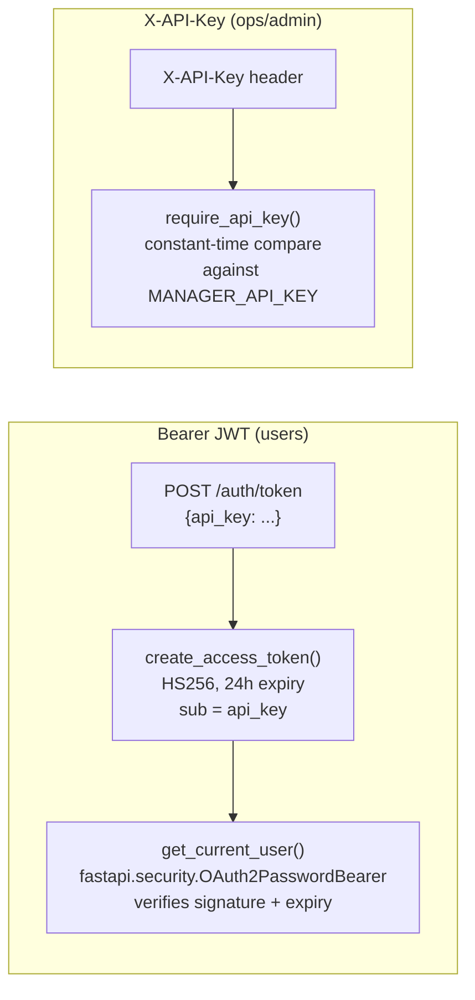

# API Gateway

> The single front door to SentinelMAS — every request from the outside world enters here, gets verified, cleaned, and handed off.

**Port:** `8000` | **Phase:** 2 | **Stack:** FastAPI · Gunicorn · Redis · PostgreSQL · slowapi

---

## For Business Stakeholders

### What does this service do?

Every interaction with the system — a customer submitting a support ticket, a manager checking a report, an operator reviewing server health — goes through the API gateway first.

Think of it as the reception desk of a secure facility. Before anyone gets in, the gateway checks their identity, decides what they're allowed to see, strips out anything suspicious, and then directs them to the right place.

### Why does this matter for security?

Without this layer, the internal AI agents and databases would be directly reachable from the internet. The gateway ensures only authenticated, validated requests ever reach the backend.

| Threat | How the gateway handles it |
|---|---|
| Unauthorized access | JWT tokens required for all user endpoints; API keys required for management endpoints |
| Prompt injection attacks | Input is scanned for known injection patterns before any AI agent sees it |
| Malicious HTML or scripts in ticket text | HTML is stripped from all user input automatically |
| Abuse / flooding the system | Rate limits enforce maximum requests per minute per endpoint, per IP |
| Sensitive information in response logs | Logs are sanitised — IP addresses, passwords, and key material are redacted before writing |

### What does it handle from each type of user?

**Customers** (JWT authenticated):
- Submit support tickets describing their server problem
- Check ticket status and receive resolution summaries
- View agent activity logs for their ticket

**Operations managers** (API key authenticated):
- View live agent states and queue depths
- See daily and weekly fleet health reports
- Monitor AI cost and token usage
- Register and manage the server fleet

**Admins** (API key authenticated):
- Add or remove servers from the fleet
- Rotate SSH credentials via the vault
- Trigger manual maintenance runs

### What happens to a ticket after submission?

```
Customer submits ticket
       ↓
Gateway verifies JWT identity
       ↓
Input is sanitised (HTML stripped, injection patterns removed)
       ↓
Ticket is saved to the database with status "queued"
       ↓
Task is pushed to the Redis work queue
       ↓
Customer receives HTTP 202 "Accepted" with a ticket ID to poll
       ↓
Agent picks up the task and begins working
       ↓
Customer polls GET /tickets/{id} to see progress and resolution
```

---

## For Senior Engineers

### Request flow



### Auth design — two schemes



**Why two schemes?**
JWT is for stateless user sessions (ticket submission, polling). The API key is for trusted internal tools and management scripts where JWT expiry management is inconvenient.

Internal routes (`/internal/*`) are additionally blocked at the nginx layer — they return 403 before reaching FastAPI.

### Input sanitiser (`sanitiser.py`)

**`sanitise_ticket_input(text)`** — runs on every `POST /tickets` body:

| Step | What it removes |
|---|---|
| HTML strip (`bleach`) | All HTML tags |
| Injection pattern 1 | `ignore previous instructions` |
| Injection pattern 2 | `disregard.*instructions` (regex) |
| Injection pattern 3 | `system:` prefix |
| Injection pattern 4 | `<\|.*\|>` token patterns |
| Truncation | Hard limit at 4000 characters |

**`sanitise_log(text)`** — runs on `GET /tickets/{id}/log` responses:

| Pattern | Replacement |
|---|---|
| IPv4 addresses | `[IP]` |
| `password=`, `token=` values | `[REDACTED]` |
| PEM key blocks | `[KEY_REDACTED]` |
| `/home/<user>` paths | `/home/[USER]` |

### Rate limiting

Uses `slowapi` (Starlette-compatible `limits` wrapper) with per-IP key function.

| Endpoint | Limit | Rationale |
|---|---|---|
| `POST /tickets` | 20/min | Prevent ticket flooding |
| `GET /tickets/{id}` | 60/min | Allow reasonable polling |
| `GET /tickets/{id}/log` | 30/min | Log reads are heavier |
| Report endpoints | 10/min | Low frequency, expensive DB queries |

429 responses include a `Retry-After` header.

### Ticket state machine

Tickets are created with `status = "queued"` and progress through:

```
queued → assigned → thinking → executing → verifying → done
                                                      ↘ failed
                                                      ↘ escalated
```

`GET /tickets/{id}` returns the current status. `resolution_summary` is populated when status reaches `done`.

### Route modules

| Module | Endpoints | Auth |
|---|---|---|
| `routes/auth.py` | `POST /auth/token` | API Key → issues JWT |
| `routes/tickets.py` | `POST /tickets`, `GET /tickets/{id}`, `GET /tickets/{id}/log` | JWT |
| `routes/reports.py` | `GET /reports/daily`, `GET /reports/daily/{date}`, `GET /reports/weekly` | JWT |
| `routes/ops.py` | `GET /ops/agents`, `GET /ops/queue`, `GET /ops/cost`, `POST /ops/cost/reset`, `GET /ops/servers` | API Key |
| `routes/admin.py` | `POST/PUT/DELETE /admin/servers`, `POST /admin/maintenance/trigger` | API Key |
| `routes/system.py` | `GET /health`, `GET /metrics` | None |

### Middleware

`RequestContextMiddleware` wraps every request:
1. Generate UUID `request_id` if `X-Request-ID` not present
2. Inject into request state and response header
3. Log structured JSON: `{request_id, method, path, status_code, duration_ms, client_ip}`
4. On unhandled exception: log with `level=error` + return 500

This ensures every request is traceable through distributed logs by `request_id`.

### ops endpoints — what they read

| Endpoint | Source | Notes |
|---|---|---|
| `GET /ops/agents` | `mas:agent:states` Redis key | Empty until Phase 4 orchestrator writes state |
| `GET /ops/queue` | Redis `LLEN` on all queues | Includes ticket status counts from Postgres |
| `GET /ops/cost` | `rate_limiter.get_utilisation()` | RPM%, TPM%, daily USD spend |
| `GET /ops/servers` | Postgres LATERAL JOIN | `server_credentials` + latest `daily_health_snapshots` |

### admin credential forwarding

`/admin/servers` CRUD does **not** handle encryption itself. It forwards to `ssh-vault` via `httpx`:

```python
# routes/admin.py pattern
async with httpx.AsyncClient() as client:
    response = await client.post(
        f"{settings.vault_url}/vault/credentials",
        json=body.model_dump(),
        headers={"X-Internal-Key": settings.internal_api_key},
    )
```

The gateway never sees the SSH key in its logs or DB — only the vault does.

### Dockerfile notes

- Build context: repo root (needs `COPY services/shared/`)
- Copies `alembic/` for migration availability
- 4 Gunicorn workers (`-w 4`) — stateless so horizontal scaling is safe

### Test coverage

```bash
pytest services/api-gateway/tests/ -v
make test-service SERVICE=api-gateway
```

| Test file | Cases | What's covered |
|---|---|---|
| `test_auth.py` | 7 | Login success/fail, token required, API key check, X-Request-ID injection |
| `test_tickets.py` | 7 | 202 response, validation, HTML strip, prompt injection removal, log sanitisation |
| `test_sanitiser.py` | 12 | All sanitiser rules for ticket input and log output |

### Design references

- `systemdev_docs/API_DESIGN.md` — full route specs, Pydantic models, auth design
- `systemdev_docs/SECURITY.md §5.1` — input sanitisation requirements
- `systemdev_docs/SECURITY.md §5.3` — log sanitisation requirements
- `infra/nginx/nginx.conf` — upstream proxy config, `/internal/*` block
- `services/api-gateway/dev_note.md` — function-level documentation
