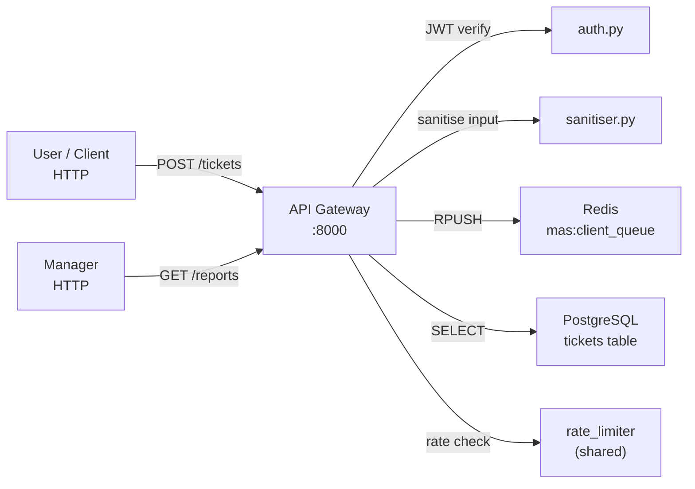

# API Gateway

Public FastAPI entrypoint for all external traffic. Handles auth, rate limiting, input sanitisation, and routes requests to the internal task queue.

**Port:** `8000` | **Built in:** Phase 2 | **Status:** scaffold

---

## Responsibility

## Planned Endpoints

| Method | Path | Auth | Purpose |
|---|---|---|---|
| `POST` | `/auth/token` | API Key | Issue JWT |
| `POST` | `/tickets` | JWT | Submit support ticket → 202 |
| `GET` | `/tickets/{id}` | JWT | Poll ticket status |
| `GET` | `/tickets/{id}/log` | JWT | Sanitised agent log |
| `GET` | `/reports/daily` | JWT | Daily fleet report |
| `GET` | `/reports/weekly` | JWT | Weekly summary |
| `GET` | `/ops/agents` | API Key | Live agent states |
| `GET` | `/ops/queue` | API Key | Queue depths |
| `GET` | `/ops/cost` | API Key | Token spend |
| `POST` | `/ops/cost/reset` | API Key | Reset daily cost counter |
| `GET` | `/ops/servers` | API Key | Registered server list |
| `POST` | `/admin/servers` | API Key | Register new server |
| `GET` | `/health` | — | Health check |
| `GET` | `/metrics` | — | Prometheus metrics |

## Design References
- `systemdev_docs/API_DESIGN.md` — full route specs, Pydantic models, auth design
- `systemdev_docs/SECURITY.md §5` — input sanitisation rules
- `services/api-gateway/dev_note.md` — function-level reference (updated as code is written)
