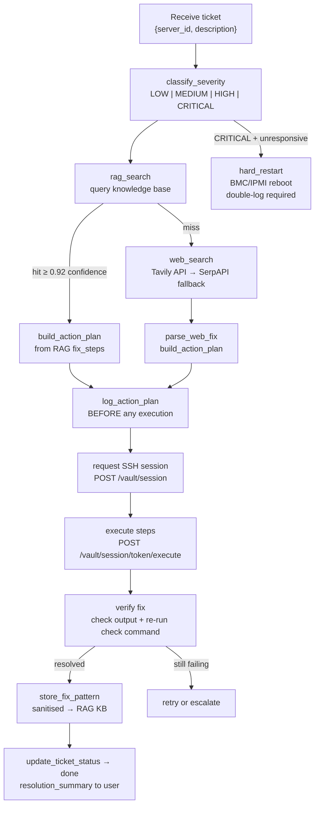

# Client Agent

Ticket resolution agent. Receives user support tickets, finds fixes via RAG + web search, SSHes into the client's rented server, executes the fix, and closes the ticket.

**Port:** `8003` | **Built in:** Phase 6 | **Status:** scaffold

---

## Ticket Resolution Flow

## Key Rules
- **RAG first, web second** — never skip the knowledge base
- **Log before execute** — action plan must be in the trace before any SSH call
- **Never store client data** — only sanitised error+fix patterns go into RAG KB
- **Hard restart** — CRITICAL severity only; requires double confirmation in logs

## Design References
- `systemdev_docs/AGENT_DESIGN.md §1.3` — full workflow, tools, system prompt
- `systemdev_docs/SECURITY.md §5` — sanitisation rules
- `services/client-agent/dev_note.md`
