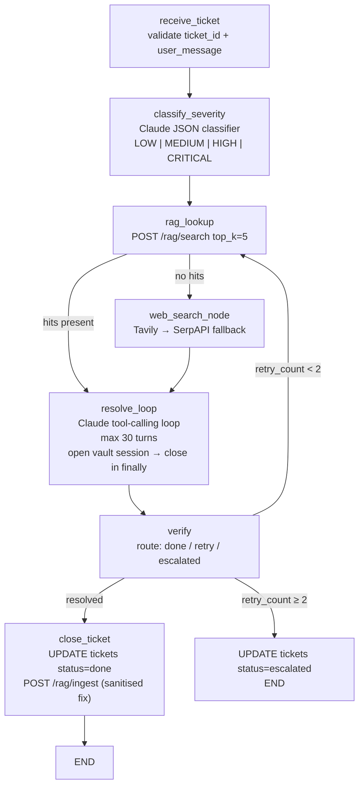
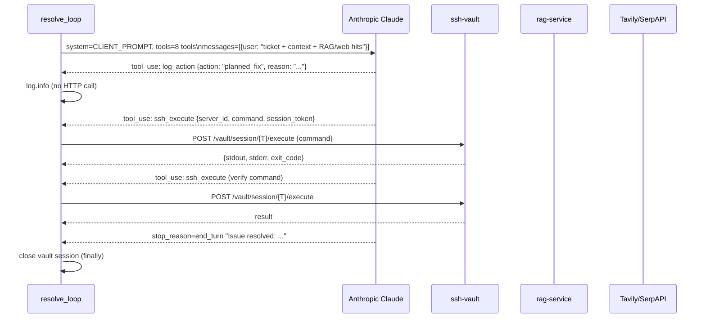
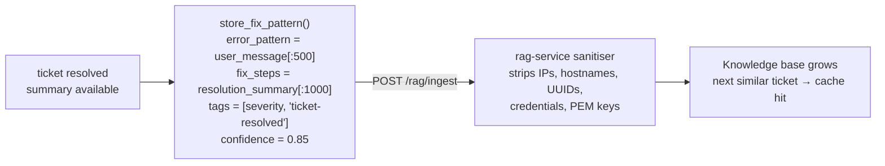
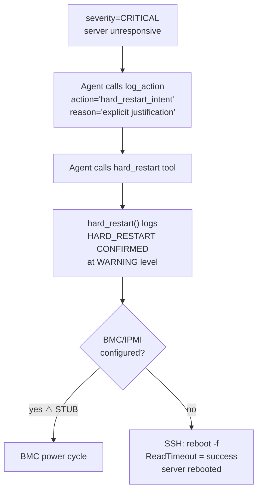

# Client Agent

> The engineer on-call who never sleeps — receives your ticket, finds the fix, SSHes in, runs it, and closes the job.

**Port:** `8003` | **Phase:** 6 | **Stack:** FastAPI · LangGraph · Anthropic Claude · Tavily · paramiko (via vault)

---

## For Business Stakeholders

### What does this agent do?

When a customer rents a GPU server and something goes wrong — a CUDA error, a crashed service, a full disk, an unresponsive process — they submit a support ticket. This agent picks it up and works on it like an experienced DevOps engineer would:

1. **Looks up the problem** in the company's private knowledge base (built from past resolved tickets)
2. **Searches the web** if the knowledge base doesn't have an answer
3. **Plans the fix** before touching anything
4. **SSHes into the customer's server** and executes the fix step by step
5. **Verifies** the fix actually worked
6. **Updates the ticket** with a plain-language summary for the customer
7. **Adds the fix** to the knowledge base so the next similar ticket is faster

### What makes this safe for customer servers?

| Risk | How it's handled |
|---|---|
| Agent running a destructive command | Every command goes through the SSH vault's safety filter — 10 classes of dangerous commands are blocked before execution |
| Agent reading or storing customer files | The system prompt explicitly prohibits reading, copying, or storing customer files or configurations |
| Agent acting without logging | The agent is instructed to log every planned action before executing — creating a full audit trail |
| Fix fails and makes things worse | The agent verifies after each fix attempt; if it fails, it retries or escalates to a human rather than continuing blindly |
| Knowledge base contaminated with customer data | Every fix stored into the knowledge base is automatically scrubbed of IPs, hostnames, usernames, and credentials before storage |

### What is a "hard restart"?

If a server is completely unresponsive — not reachable by SSH, not responding to any commands — and the ticket is marked CRITICAL, the agent can trigger a hard power cycle via BMC/IPMI (the server's out-of-band management interface).

This is the last resort. It requires the agent to:
1. Log its intent with an explicit reason
2. Log confirmation again at the moment of execution

Both log entries are permanent and auditable. The action is never silent.

### What does the customer receive?

- Real-time ticket status updates as the agent works
- A plain-language resolution summary (not raw terminal output) when done
- No exposure of other customers' data or server details

---

## For Senior Engineers

### Full resolution graph



### Claude tool-calling loop (resolve_loop node)



### Knowledge base feedback loop

When a ticket resolves successfully, the fix is automatically fed back into the RAG knowledge base — but only after sanitisation:



This is the compounding value loop: every resolved ticket makes the next one faster.

### Hard restart safety protocol



**Double-log requirement:**
- Log 1 (intent): agent calls `log_action` — creates structured log before the tool call
- Log 2 (confirmed): `hard_restart()` itself logs `HARD_RESTART CONFIRMED` with server_id, agent_id, trace_id, timestamp

Both are permanent. Neither can be bypassed — they're in different code paths.

**BMC status:** ⚠️ STUB — `_try_bmc_restart()` always returns `{success: False}`, causing fallback to SSH. Real BMC integration requires per-server BMC hostname/credentials, which are infrastructure-specific.

### Web search fallback chain

```
Tavily API (settings.tavily_api_key set?)
    → SerpAPI (settings.serpapi_key set?)
        → [] empty list (graceful degradation)
```

Neither key is required to run. The agent continues with fewer resources rather than failing.

### Severity classification

One Claude call with `SEVERITY_SYSTEM_PROMPT` before the main agent loop. Output is constrained to JSON:

```json
{"severity": "HIGH", "reason": "SSH connection refused, server unreachable"}
```

Invalid JSON or unknown level → default `MEDIUM`. This classification informs the agent's reasoning and determines whether `hard_restart` is available as a tool option.

### Vault session management

```python
session_token = await open_vault_session(server_id, task_id, trace_id)
try:
    # all SSH calls in the 30-turn loop
finally:
    await close_vault_session(session_token)  # always closes
```

If `open_vault_session` fails, the node returns `status=failed` immediately — no retry, no partial execution. The ticket is marked failed and the orchestrator is notified.

### Retry logic

`verify_node` routes based on `resolved` and `retry_count`:

| Condition | Route |
|---|---|
| `resolved=True` | `close_ticket` → `END` |
| `resolved=False`, `retry_count < 2` | back to `rag_lookup` (with cleared hits to force fresh search) |
| `resolved=False`, `retry_count >= 2` | `escalated` → `END` |

### Test coverage

```bash
pytest services/client-agent/tests/ -v
make test-service SERVICE=client-agent
```

| File | Cases | What's covered |
|---|---|---|
| `test_severity.py` | 5 | Valid levels, invalid JSON fallback, API error fallback, invalid level normalisation |
| `test_hard_restart.py` | 6 | BMC stub fallback, double-log confirmation, ReadTimeout as success, reason/timestamp in result |
| `test_tools.py` | 10 | RAG search hit/miss, SSH execute, store_fix_pattern success/failure, dispatch routing, ticket status update |

### Failure modes

| Failure | Behaviour |
|---|---|
| Vault session fails to open | `status=failed` immediately; orchestrator notified |
| Claude hits 30-turn limit | Loop exits with `resolved=False`; enters retry/escalate path |
| RAG service down | `rag_search` returns `{results: [], error: ...}`; agent falls back to web search |
| Both web search providers down | Returns `[]`; agent attempts fix from Claude's general knowledge |
| SSH command fails | Error captured as tool_result; Claude reasons about it and tries alternative |
| Ticket DB update fails | Logged as error; orchestrator status callback still attempted |

### Design references

- `systemdev_docs/AGENT_DESIGN.md §1.3` — full workflow, tools, system prompt
- `systemdev_docs/SECURITY.md §5` — sanitisation requirements
- `services/rag-service/README.md` — KB feedback loop
- `services/ssh-vault/README.md` — session lifecycle
- `services/client-agent/dev_note.md` — function-level documentation
