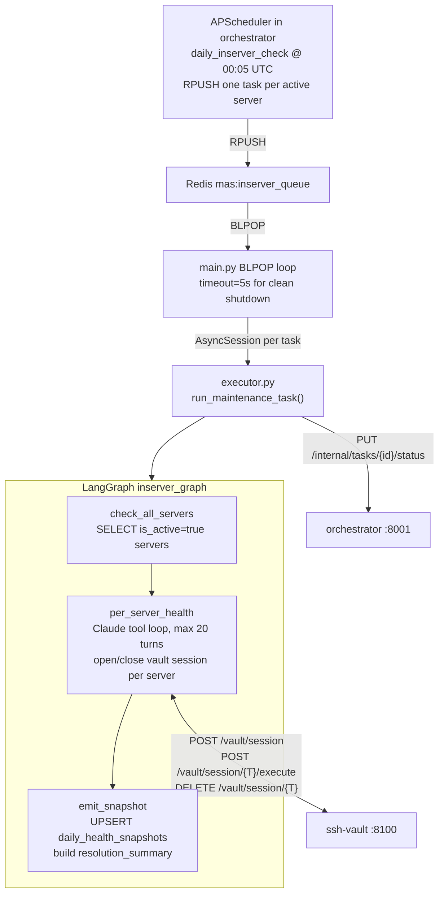
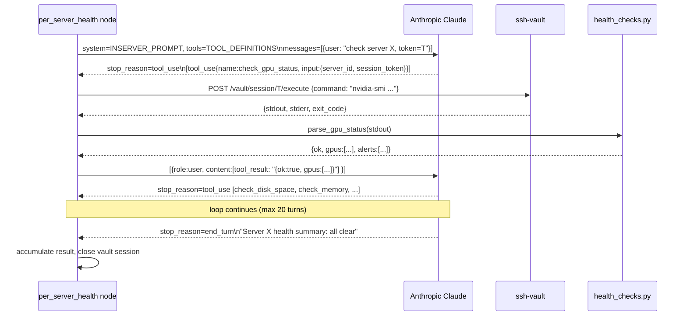
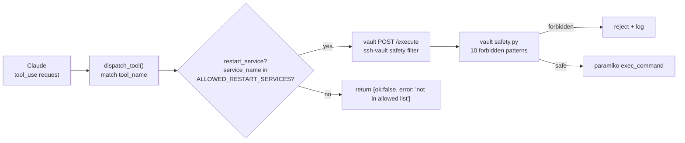

# InServer Agent

> The autonomous maintenance crew that inspects every GPU server every night — without waking anyone up.

**Port:** `8002` | **Phase:** 5 | **Stack:** FastAPI · LangGraph · Anthropic Claude · paramiko (via vault)

---

## For Business Stakeholders

### What does this agent do?

Every night at 00:05, this agent wakes up and systematically checks every GPU server the company operates — not just pings, but real deep health checks:

- Are all GPUs running at safe temperatures?
- Is any GPU running out of memory?
- Are there GPU driver errors accumulating?
- Is disk space running low?
- Are key services (GPU driver daemon, Docker, SSH) actually running?
- Has the server accidentally blocked our own management system?

After checking, it fixes what it can on its own and flags everything else for the team.

### What can it fix without human involvement?

| Problem | Automatic fix |
|---|---|
| The server blocked our management IP in its firewall | Removes the block automatically |
| The GPU persistence daemon stopped running | Restarts it |
| The Docker service crashed | Restarts it |
| A log file has grown past 10GB | Clears it after logging the action |

### What does it never touch without approval?

- Reboots — a reboot interrupts active customer workloads
- Network configuration — a misconfigured network rule could lock us out permanently
- User accounts — any account change is a security-sensitive operation
- Kernel changes — these require planning and a maintenance window

If the agent finds a problem outside its allowed operations, it records it clearly in the daily report with its reasoning. The team decides what to do next.

### Why does this matter for the business?

**Without this agent:** A team member manually logs into every server each morning. At 10 servers this is tedious. At 50 servers it's a full-time job. At 200 servers it's impossible.

**With this agent:** The team wakes up to a clear status dashboard. Overnight issues are already documented, and the fixable ones are already resolved. The team focuses on what the agent cannot handle.

### Where do the results go?

Every night's check is stored in the database as a **daily health snapshot** per server. These feed:
- The ops dashboard (visible to managers in real-time)
- The weekly summary report (sent automatically Monday morning)
- Fleet health trend charts (Phase 8 Grafana dashboards)

---

## For Senior Engineers

### Architecture overview



### Claude tool-calling loop (per server)



### Health check parsers — design principle

All parsers in `health_checks.py` are **pure functions**: they take raw SSH stdout strings and return structured dicts. Zero I/O, zero dependencies. This makes them trivially unit-testable without SSH infrastructure — just pass mock output strings.

| Parser | Command | Alert conditions |
|---|---|---|
| `parse_gpu_status` | `nvidia-smi --query-gpu=... --format=csv,noheader,nounits` | temp > 85°C, mem > 90%, ECC errors > 0 |
| `parse_disk_space` | `df -h --output=source,size,used,avail,pcent,target` | use ≥ 85% (warning), ≥ 95% (critical) |
| `parse_memory` | `free -m` | use > 90% |
| `parse_process_health` | `systemctl status <svc>` | not "active (running)" |
| `parse_ssh_blacklist` | `fail2ban-client status sshd` + `iptables -L INPUT -n` | own_ip in either output |

### Tool safety layers



Two safety gates:
1. `tools.py` — allowed restart service list
2. `ssh-vault safety.py` — 10 forbidden command patterns (rm -rf /, mkfs, dd, etc.)

### Vault session lifecycle per server

```python
session_token = await open_vault_session(server_id, task_id, trace_id)
try:
    # all SSH calls for this server
finally:
    await close_vault_session(session_token)  # always, even on error
```

If `open_vault_session` raises (server unreachable, vault down), the server is logged as `status=unreachable` and the loop continues — one bad server doesn't halt the entire fleet check.

### Daily health snapshot upsert

```sql
INSERT INTO daily_health_snapshots (server_id, date, metrics_json, status, created_at)
VALUES (:sid, :date, :metrics::jsonb, :status, now())
ON CONFLICT (server_id, date) DO UPDATE
  SET metrics_json = EXCLUDED.metrics_json,
      status = EXCLUDED.status
```

Re-running on the same day overwrites the row — safe for re-triggers and retry scenarios.

### LangGraph state extras

These fields are added on top of the canonical `AgentState`:

| Field | Type | Set by | Purpose |
|---|---|---|---|
| `server_list` | list[dict] | check_all_servers node | [{server_id, hostname}] from DB |
| `server_results` | dict | per_server_health node | {server_id → {status, alerts, fixes_applied, summary}} |

### Test coverage

```bash
pytest services/inserver-agent/tests/ -v
make test-service SERVICE=inserver-agent
```

| File | Cases | What's covered |
|---|---|---|
| `test_health_checks.py` | 27 | All 5 parsers: normal, high usage, critical, empty output, multi-GPU |
| `test_tools.py` | 8 | Allowed/disallowed restart enforcement, unblock IP two-step, dispatch routing |

### Failure modes

| Failure | Behaviour |
|---|---|
| Server SSH session fails to open | Marked `unreachable`; loop continues to next server |
| Claude reaches 20-turn limit | Loop exits; partial results written to snapshot |
| Tool raises exception | Caught; error returned as tool_result; Claude continues reasoning |
| Snapshot DB write fails | Error logged; task still reports to orchestrator |
| Orchestrator unreachable for status callback | Warning logged; snapshot already persisted in DB |

### Design references

- `systemdev_docs/AGENT_DESIGN.md §1.2` — InServer agent spec, tools, system prompt
- `services/ssh-vault/README.md` — vault session lifecycle
- `alembic/dev_note.md` — `daily_health_snapshots`, `server_credentials` schemas
- `services/inserver-agent/dev_note.md` — function-level documentation
