# InServer Agent

Daily maintenance agent for the company's own GPU server fleet. Runs on schedule, checks every server's health, auto-fixes allowed issues, emits daily snapshots.

**Port:** `8002` | **Built in:** Phase 5 | **Status:** scaffold

---

## Daily Workflow

```mermaid
flowchart TD
    TRIGGER["Scheduler fires\ndaily_inserver_check"] --> TASK["Orchestrator enqueues\nmaintenance task"]
    TASK --> AGENT["InServer Agent\npicks up task"]
    AGENT --> SERVERS["get_server_list()\nfetch all active servers"]
    SERVERS --> PARALLEL["Parallel execution\nbounded by semaphore"]

    PARALLEL --> PROBE["ssh_check_connectivity\nping + SSH handshake"]
    PROBE -->|unreachable| FLAG["flag for human review"]
    PROBE -->|ok| CHECKS["Health checks"]

    CHECKS --> GPU["check_gpu_status\nnvidia-smi parser"]
    CHECKS --> DISK["check_disk_space\ndf -h parser"]
    CHECKS --> MEM["check_memory\nfree -m parser"]
    CHECKS --> PROC["check_process_health\nsystemctl status"]
    CHECKS --> BL["check_ssh_blacklist\nfail2ban + iptables"]

    BL -->|own IP blocked| UNBLOCK["unblock_own_ip\nremove from fail2ban"]
    PROC -->|service down| RESTART["restart_service\nsystemctl restart"]

    GPU & DISK & MEM & PROC & BL --> SNAP["emit_health_snapshot\nwrite to daily_health_snapshots table"]
    SNAP --> REPORT["Aggregate → Report Agent"]
```

## Allowed vs Forbidden Operations

| Allowed (autonomous) | Forbidden (needs human) |
|---|---|
| Unblock own IP from firewall | Kernel changes |
| Restart: nvidia-persistenced, docker, ssh, cron | Reboots |
| Clear log files > 10GB (logged before) | Network config changes |
| | User account changes |

Every action is **logged before execution** — no silent operations.

## Design References
- `systemdev_docs/AGENT_DESIGN.md §1.2` — tools list, system prompt, allowed ops
- `systemdev_docs/REQUIREMENTS.md FR-01` — functional requirements
- `services/inserver-agent/dev_note.md`
