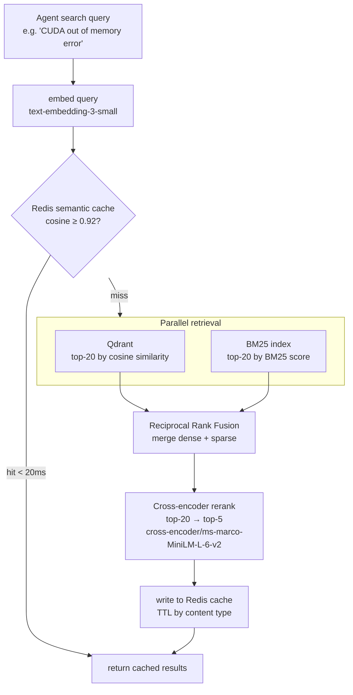
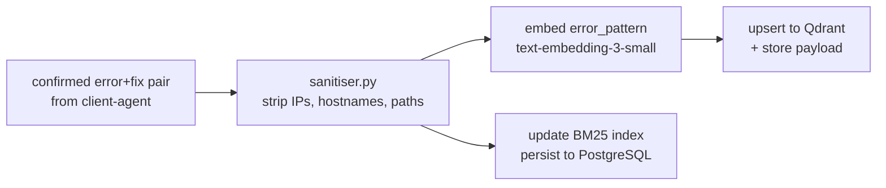

# RAG Service

Hybrid retrieval service for GPU error+fix patterns. Dense vector search (Qdrant) + sparse BM25, merged with Reciprocal Rank Fusion, reranked by a cross-encoder, with a Redis semantic cache in front.

**Port:** `8005` | **Built in:** Phase 3 | **Status:** scaffold

---

## Query Pipeline

## Ingest Pipeline

## Cache TTL Policy

| Content Type | TTL |
|---|---|
| Active error fix (recent) | 1 hour |
| Static / general knowledge | 24 hours |
| Web search results | 30 minutes |

**KB starts empty.** System degrades gracefully to web search fallback until patterns are populated from real ticket resolutions.

## Design References
- `systemdev_docs/AGENT_DESIGN.md §3` — full RAG architecture
- `alembic/dev_note.md` — `rag_kb_entries` table schema
- `services/rag-service/dev_note.md`
