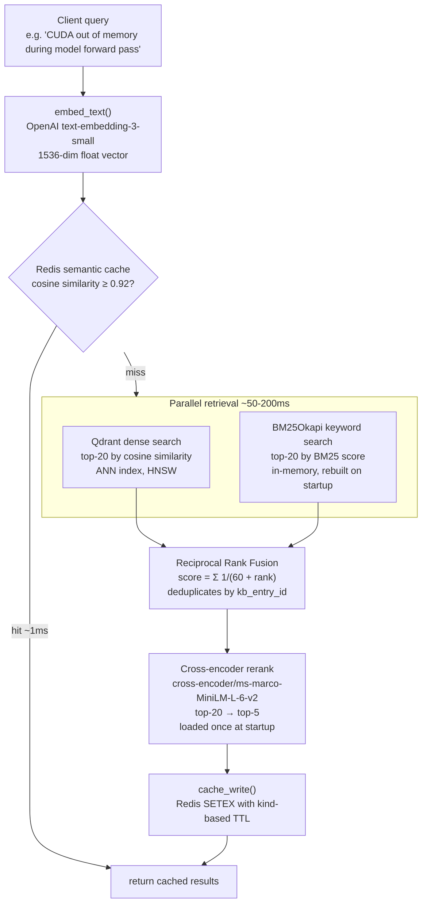
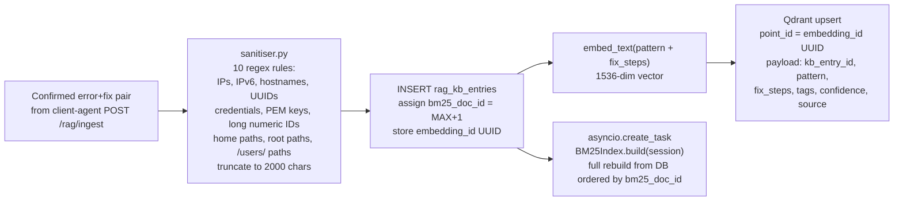
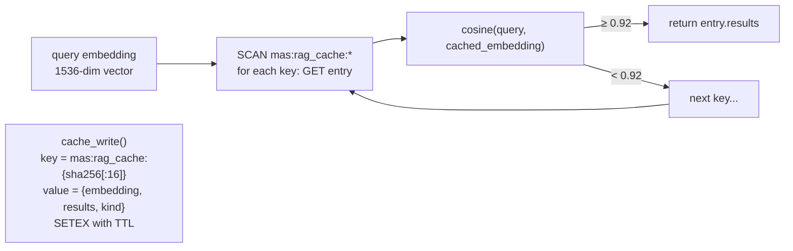

# RAG Service

> The knowledge brain of SentinelMAS — learns from every resolved incident and gets smarter over time.

**Port:** `8005` | **Phase:** 3 | **Stack:** FastAPI · Qdrant · OpenAI · Redis · PostgreSQL

---

## For Business Stakeholders

### What problem does this solve?

Every time an agent fixes a GPU server problem, the solution is recorded here.
The next time the same — or a similar — problem appears on any server, the system finds the answer in seconds instead of searching the internet from scratch.

Over time this knowledge base becomes the company's most valuable operational asset: a private library of battle-tested GPU fixes that your competitors don't have.

### What does "smarter over time" actually mean?

- **Day 1:** The knowledge base starts empty. Agents fall back to web search.
- **Week 1:** After a handful of tickets, common CUDA, disk, and driver errors have stored fixes.
- **Month 1:** Most tickets are resolved using internal knowledge. Web search is a last resort.
- **Year 1:** The company's entire GPU error history is searchable in milliseconds, with confidence scores so agents know how reliable each fix is.

### Why should you trust it?

| Concern | How it is handled |
|---|---|
| Sensitive data leaking into the knowledge base | Every entry is scrubbed before storage: IP addresses, hostnames, usernames, API keys, and SSH keys are all stripped automatically |
| Stale or wrong fixes polluting results | Each fix has a confidence score. Lower-confidence fixes are shown to agents with appropriate warnings |
| The system returning irrelevant results | Three independent ranking methods are combined — if one misses, the others catch it |
| A single point of failure | The cache, vector store, and keyword index are separate — any two can fail and search still works |

### Business value summary

- Reduces average ticket resolution time as the knowledge base grows
- Reduces external API costs — cached answers cost nothing
- Builds a proprietary, company-owned knowledge asset
- Zero manual curation required — populated automatically from real resolutions

---

## For Senior Engineers

### Architecture overview

The RAG service implements a **multi-stage hybrid retrieval pipeline** designed to maximise recall (find relevant fixes) and precision (surface the best one first).



### Ingest pipeline



### Component design decisions

**Why hybrid search (dense + sparse)?**
Dense (vector) search excels at semantic similarity — "GPU ran out of memory" matches "CUDA allocation failure" even with no shared words.
BM25 excels at exact keyword matches — model names, error codes, package versions.
Neither alone is sufficient; RRF combines both without requiring weight tuning.

**Why cross-encoder rerank after RRF?**
Bi-encoder embeddings (used for dense search) trade accuracy for speed.
Cross-encoder models read the full (query, passage) pair jointly — far more accurate but too slow to run at retrieval time.
Running it on the top-20 RRF candidates is the correct tradeoff: cheap retrieval, accurate ranking.

**Why rebuild BM25 from DB on every ingest rather than serialise?**
Serialised BM25 indices (pickle) have version fragility across Python/rank-bm25 upgrades.
At GPU-error KB scale (<100k docs), a full rebuild takes <1 s. PostgreSQL is the authoritative source; the in-memory index is ephemeral.

**Why O(n) cosine scan for the semantic cache?**
At the expected scale of cached queries (<10k entries), a Redis SCAN + cosine comparison is <5 ms and requires zero infrastructure (no vector index in Redis needed).
If scale grows, this is the first component to replace with a Redis vector search module.

### Semantic cache design



**Cache TTL policy**

| Kind | TTL | Rationale |
|---|---|---|
| `active` | 3600 s (1 h) | Recent error fixes — server state changes; fix may become stale |
| `static` | 86400 s (24 h) | General GPU/Linux knowledge — stable across days |

**Threshold rationale:** 0.92 cosine similarity on `text-embedding-3-small` embeddings corresponds to queries that are paraphrases of each other (same error, different wording). Below 0.92, query intent begins to diverge enough that a different retrieval is warranted.

### API endpoints

| Method | Path | Purpose |
|---|---|---|
| `POST` | `/rag/search` | Full pipeline: cache → hybrid → rerank |
| `POST` | `/rag/ingest` | Add error+fix pair to KB |
| `DELETE` | `/rag/entry/{id}` | Remove entry from DB + Qdrant |
| `GET` | `/rag/stats` | KB size, BM25 size, cache stats |
| `GET` | `/health` | Liveness probe |

**Search request:**
```json
{
  "query": "nvidia-smi shows GPU memory leak after training job",
  "top_k": 5,
  "tags": ["cuda", "memory"],
  "use_cache": true
}
```

**Search response:**
```json
{
  "results": [
    {
      "kb_entry_id": 42,
      "error_pattern": "GPU memory not released after PyTorch training loop...",
      "fix_steps": "1. Add torch.cuda.empty_cache() after training. 2. Verify...",
      "rerank_score": 8.34,
      "rrf_score": 0.031,
      "source": "ticket-resolution",
      "tags": ["cuda", "pytorch", "memory"]
    }
  ],
  "cache_hit": false,
  "total": 1
}
```

### Security notes

- No auth on endpoints — service is on the `internal` Docker network only (not exposed via nginx)
- Sanitiser runs before any text touches the DB or vector store — PII cannot enter the KB
- Qdrant collection `gpu_errors` stores no client-identifiable data (sanitiser strips server IDs, UUIDs, paths)

### Startup sequence

1. Create async SQLAlchemy engine
2. Connect to Redis
3. `vector_store.ensure_collection()` — idempotent Qdrant collection creation
4. `bm25_mod.init_index(session)` — rebuild BM25 from `rag_kb_entries`
5. `reranker.preload_model()` — load cross-encoder via `asyncio.to_thread` (blocks until ready)
6. FastAPI begins accepting requests

### Performance characteristics

| Operation | Expected latency |
|---|---|
| Cache hit | < 5 ms |
| Embedding (single text) | 80–150 ms (OpenAI API) |
| Dense + sparse retrieval | 10–50 ms |
| Cross-encoder rerank (top-20) | 20–80 ms |
| Full pipeline (cache miss) | 150–300 ms |

### Design references

- `systemdev_docs/AGENT_DESIGN.md §3` — full RAG architecture spec
- `systemdev_docs/SECURITY.md §5.1` — sanitiser requirements
- `alembic/dev_note.md` — `rag_kb_entries` table schema
- `services/rag-service/dev_note.md` — function-level documentation
