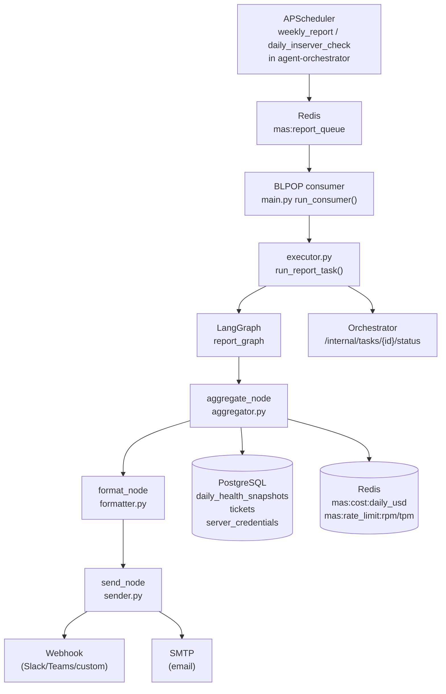

# Report Agent

> The agent that turns raw operational data into a clear, actionable report — automatically delivered to your inbox or Slack every morning.

**Port:** `8004` | **Phase:** 7 | **Stack:** FastAPI · LangGraph · SQLAlchemy · Redis · SMTP · Webhook

---

## For Business Stakeholders

### What does this agent do?

Every day (and every week), SentinelMAS automatically generates an operations report and delivers it to whoever manages the infrastructure — no manual work required.

The report tells you:

1. **Which servers are healthy** and which need attention — at a glance
2. **How many support tickets were handled** and how fast they were resolved
3. **How much the AI system cost to run** (API spend, token usage)
4. **What needs your attention** — escalated tickets, servers with low uptime, resolution rate drops
5. **What actions are recommended** based on what was found

### What does a report look like?

A typical daily report contains:

- A server status table: each GPU server, its CPU/memory/disk/GPU temperature, and its health status
- A ticket summary table: how many tickets came in, were resolved, failed, escalated, and the average time to fix
- A cost summary: daily API spend in USD, peak request rate
- An alerts section: any escalated tickets that a human should review
- Recommended actions: clear, specific steps if anything is wrong

Critical problems are highlighted in **bold** and marked with 🔴 so nothing important gets buried.

### Where is the report delivered?

The report goes to wherever you configure:

- **Slack or Teams** — via an incoming webhook (one setting to configure)
- **Email** — via SMTP (standard corporate mail relay supported)
- Both at once if needed

If neither is configured, the report is still generated and stored in logs — nothing is lost.

### Who triggers the report?

Reports are triggered automatically:
- **Daily report**: every day at a scheduled time (set by the orchestrator)
- **Weekly report**: every Monday morning, covering the past 7 days

No manual action required. The system handles it.

---

## For Senior Engineers

### Architecture



### Graph nodes

```
aggregate_node → format_node → send_node → END
```

All three nodes short-circuit on `status=failed` — no partial delivery. Errors are surfaced back to the orchestrator.

### State fields

| Field | Type | Purpose |
|---|---|---|
| `task_id` | str | Task identifier from orchestrator |
| `period` | str | `"daily"` \| `"weekly"` |
| `report_date` | str | ISO date (daily only, optional) |
| `aggregated_data` | dict | Raw data bundle from aggregator |
| `report_text` | str | Rendered markdown |
| `status` | str | `"done"` \| `"failed"` |
| `delivery_result` | dict | `{webhook: bool, email: bool}` |
| `error` | str | Error message on failure |

### Data sources

| Data | Source | Key / Table |
|---|---|---|
| Fleet health (daily) | PostgreSQL | `daily_health_snapshots JOIN server_credentials` |
| Fleet health (weekly trend) | PostgreSQL | `daily_health_snapshots` last 7 days |
| Ticket stats | PostgreSQL | `tickets` table with FILTER aggregates |
| Recent escalations | PostgreSQL | `tickets WHERE status='escalated'` |
| Daily cost | Redis | `mas:cost:daily_usd` |
| Rate limit usage | Redis | `mas:rate_limit:rpm`, `mas:rate_limit:tpm` |
| Weekly cost detail | ⚠️ STUB | Langfuse integration deferred to Phase 8 |

### Delivery channels

`sender.py` tries both configured channels independently:

```python
webhook_ok = await send_webhook(report_text, subject)  # async httpx POST
email_ok   = send_email(report_text, subject)           # sync smtplib
```

Neither failure blocks the other. If both fail, a warning is logged and the orchestrator is still notified with `status=done` (report was generated; delivery is best-effort).

### Report format

`formatter.py` is a pure function module — no I/O, no external deps. Each section is built by a dedicated `_render_*` function:

```
format_daily_report(data) → str
  ├── _render_fleet_health(fleet)
  ├── _render_ticket_stats(tickets)
  ├── _render_cost(cost)
  ├── _render_escalations(escalations)
  └── recommended actions (inline logic)

format_weekly_report(data) → str
  ├── _render_weekly_fleet(fleet_range, uptime_pct)
  ├── _render_ticket_stats(tickets)
  ├── _render_cost(cost, weekly_cost)
  └── _render_escalations(escalations)
```

`wrap_html(markdown, subject)` provides a minimal HTML shell for SMTP multipart delivery — escapes HTML entities and wraps in `<pre>`, not a full markdown renderer.

### Uptime calculation (weekly)

```python
uptime_pct[server_id] = healthy_days / total_days * 100
```

`healthy_days` = count of daily snapshots with `status="healthy"`. Threshold for recommended action: < 90%.

### Test coverage

```bash
pytest services/report-agent/tests/ -v
```

| File | Cases | Coverage |
|---|---|---|
| `test_formatter.py` | 22 | All render helpers, daily/weekly report content, critical prefix, edge cases, HTML escaping |
| `test_sender.py` | 11 | Webhook success/fail/no-url/exception, SMTP success/fail/no-config, deliver_report combinations |

### Report content rules

- No raw server IPs in user-facing output
- No client file content or user PII
- Critical events highlighted in bold
- Tables and bullet points for scannability

### Design references

- `systemdev_docs/AGENT_DESIGN.md §1.4` — report agent design, required sections
- `systemdev_docs/TODO.md §Phase 7` — task list
- `services/report-agent/dev_note.md` — function-level documentation
