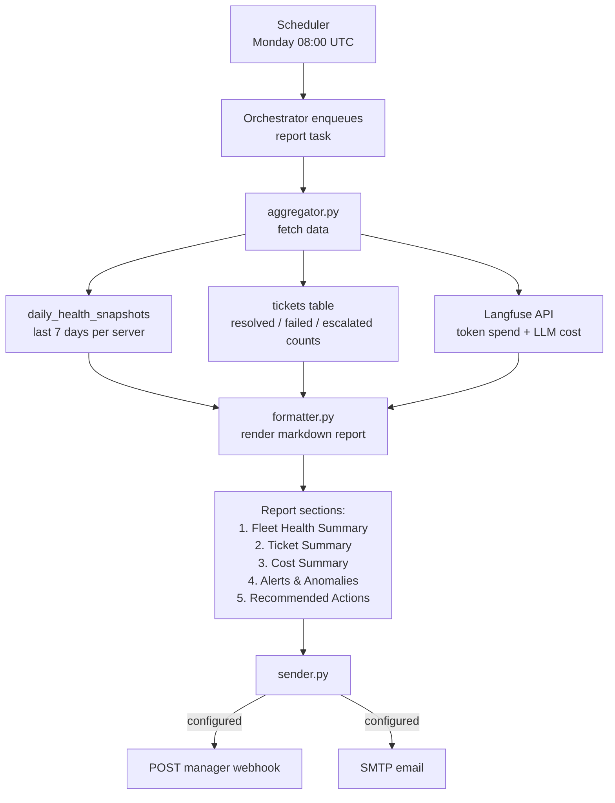

# Report Agent

Aggregates daily health snapshots and ticket statistics, formats a structured markdown report, and delivers it to the manager via webhook or email.

**Port:** `8004` | **Built in:** Phase 7 | **Status:** scaffold

---

## Report Generation Flow

## Report Content Rules
- No raw server IPs in user-facing output
- No client file content or user PII
- Critical events highlighted in bold
- Uses tables and bullet points for scannability

## Design References
- `systemdev_docs/AGENT_DESIGN.md §1.4` — tools, system prompt, report sections
- `alembic/dev_note.md` — `daily_health_snapshots`, `tickets` table schemas
- `services/report-agent/dev_note.md`
