# Scheduler

Lightweight APScheduler container that fires cron tasks to the orchestrator. Uses PostgreSQL as the job store so jobs survive container restarts.

**Built in:** Phase 4 (alongside orchestrator) | **Status:** scaffold

---

## Scheduled Jobs

```mermaid
gantt
    title Scheduler — Daily Timeline (UTC)
    dateFormat HH:mm
    axisFormat %H:%M

    section Daily
    daily_inserver_check  : milestone, 00:00, 0m

    section Hourly
    hourly_cache_cleanup  : 00:00, 60m
    hourly_cache_cleanup  : 01:00, 60m
    hourly_cache_cleanup  : 02:00, 60m

    section Weekly (Monday)
    weekly_report         : milestone, 08:00, 0m
```

| Job | Cron | What It Does |
|---|---|---|
| `daily_inserver_check` | `0 0 * * *` | POST to orchestrator for each active server → maintenance task |
| `weekly_report` | `0 8 * * 1` | POST to orchestrator → report generation task |
| `hourly_cache_cleanup` | `0 * * * *` | Clear expired Redis semantic cache entries |

## Job Store
Jobs are persisted in the `apscheduler_jobs` PostgreSQL table (migration 006).
If the scheduler container restarts, APScheduler re-loads pending jobs automatically.

## Design References
- `systemdev_docs/SYSTEM_DESIGN.md §2.8` — scheduler design
- `alembic/dev_note.md` — `apscheduler_jobs` table
- `services/scheduler/dev_note.md`
