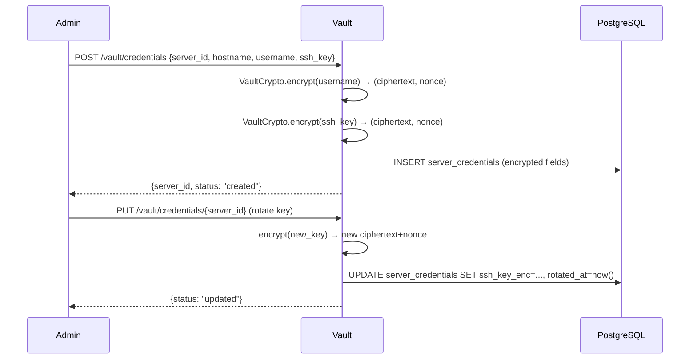
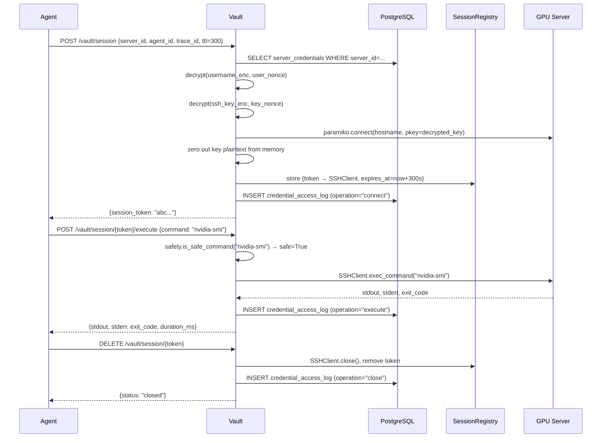
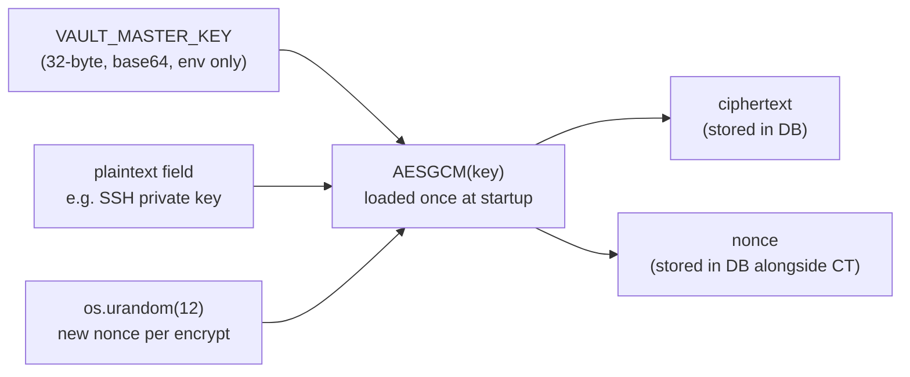

# SSH Vault Service

Internal-only credential store for GPU server SSH keys.
Agents **never** receive raw key bytes — they get a short-lived session token backed by an in-process `paramiko.SSHClient`.

**Port:** `8100` | **Network:** internal only | **Auth:** `X-Internal-Key` header

---

## Why It Exists

Every agent that needs to SSH into a server calls this service instead of holding keys itself. This creates a single, audited chokepoint:

- Keys are encrypted at rest (AES-256-GCM, master key in env only)
- Every access is logged with `{agent_id, server_id, trace_id, operation}`
- Dangerous commands are rejected before reaching the server

---

## Credential Lifecycle



---

## SSH Session Lifecycle



---

## Command Safety Filter

Before any command reaches the server, `safety.py` checks it against forbidden patterns:

| Pattern | Reason Blocked |
|---|---|
| `rm -rf /` or `rm -rf ~/` | Recursive delete from root |
| `mkfs.*` | Filesystem format |
| `dd ... of=/dev/` | Raw device write |
| `> /dev/sda` | Direct block device write |
| `chmod 777 /` | World-writable root |
| `:(){ :|:& };:` | Fork bomb |
| `curl ... \| bash` | Pipe URL to shell |
| `poweroff` / `shutdown` | System power-off |
| `iptables -F` | Flush all firewall rules |

If blocked: command is rejected, attempt is logged, no SSH call is made.

---

## Encryption Design



- One nonce per field per encrypt call — reuse would break GCM security
- Tampered ciphertext raises `cryptography.exceptions.InvalidTag`
- Master key is never logged, never returned via API, zeroed on GC (best-effort)

---

## File Structure

```
ssh-vault/
├── main.py              # FastAPI app, startup/shutdown hooks, /health
├── config.py            # Pydantic settings (env vars)
├── crypto.py            # VaultCrypto: AES-256-GCM encrypt/decrypt
├── models.py            # SQLAlchemy ORM: ServerCredential, CredentialAccessLog
├── routes.py            # All API endpoints
├── safety.py            # is_safe_command() filter
├── session_registry.py  # token → SSHClient store with TTL eviction
├── requirements.txt
├── Dockerfile
├── dev_note.md          # Function-level reference for Claude
└── tests/
    ├── test_crypto.py          # 8 encrypt/decrypt cases
    ├── test_safety.py          # 20 allow/block cases
    └── test_session_registry.py # 11 lifecycle cases
```

---

## Running Tests

```bash
# From repo root
pytest services/ssh-vault/tests/ -v

# Or via Make
make test-service SERVICE=ssh-vault
```

---

## API Reference

| Method | Path | Purpose |
|---|---|---|
| `POST` | `/vault/credentials` | Register new server credential |
| `PUT` | `/vault/credentials/{server_id}` | Update or rotate credential |
| `DELETE` | `/vault/credentials/{server_id}` | Deactivate credential |
| `POST` | `/vault/session` | Open SSH session → token |
| `POST` | `/vault/session/{token}/execute` | Run command on session |
| `DELETE` | `/vault/session/{token}` | Close session |
| `GET` | `/health` | Service health + active session count |

All endpoints require header: `X-Internal-Key: <INTERNAL_API_KEY>`
