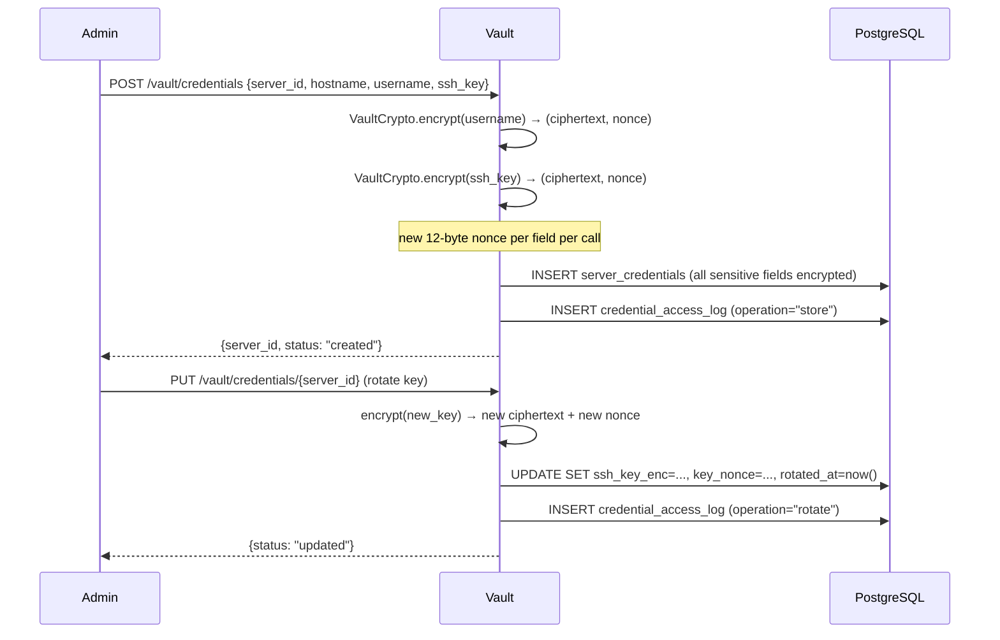
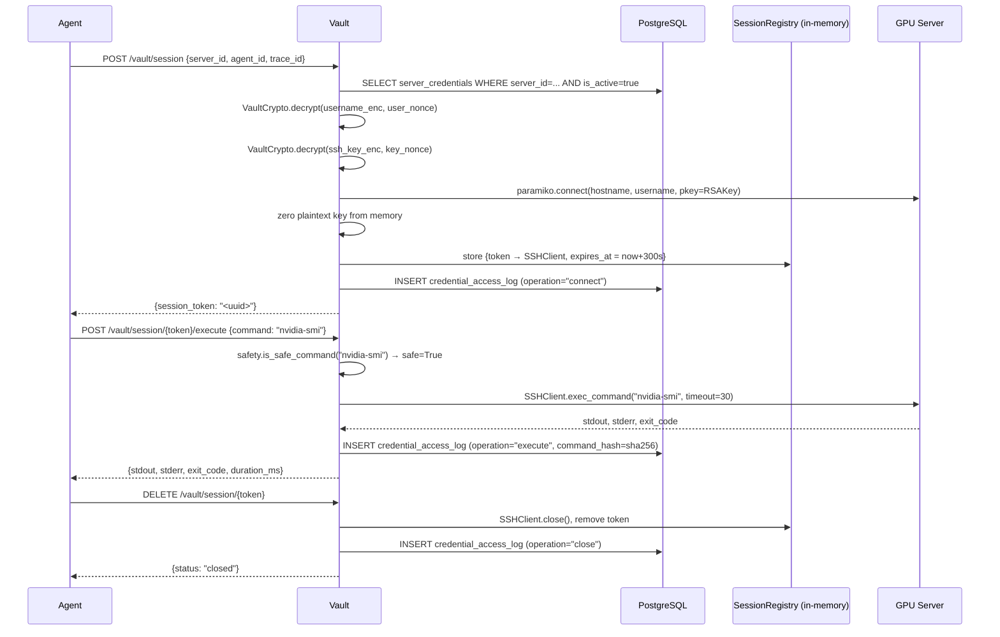
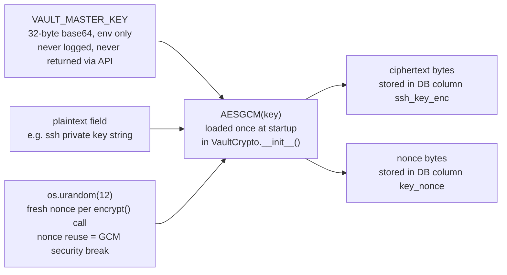
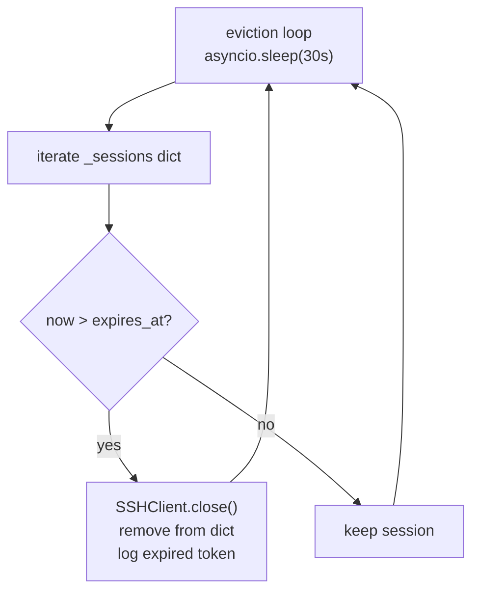

# SSH Vault Service

> The only place in the system that ever touches a raw SSH key — everything else gets a short-lived, monitored session token.

**Port:** `8100` | **Phase:** 1 | **Network:** internal only | **Auth:** `X-Internal-Key` header

---

## For Business Stakeholders

### What is this protecting?

SSH keys are the master passwords to your GPU servers. If one is stolen, an attacker has full control over that machine and everything on it — including your customers' data, workloads, and billing.

This service exists so that no part of the AI system ever holds a raw SSH key. Agents get a time-limited access token that expires after 5 minutes. The key itself never leaves this vault.

### What does that mean in practice?

- An agent gets compromised? The attacker gets a session token that's already expired — not the key.
- A bug causes a container to crash mid-operation? The SSH session closes automatically. No dangling connections.
- Someone tries to run a dangerous command like wiping a disk? The vault blocks it before it ever reaches the server.
- A security audit asks "who accessed which server, when, and what did they do?" — the vault has a complete, immutable log.

### Why should you trust this design?

| Risk | How the vault handles it |
|---|---|
| SSH key theft from memory | Keys are decrypted in-memory only to open the connection, then immediately zeroed — never stored as plaintext again |
| Keys leaked in logs | The command safety filter and logging layer never record credential material |
| Insider threat — agent misbehaving | Every command is checked against a forbidden list before execution; every action is audit-logged with the agent's identity |
| Accidental destructive command | Dangerous commands are rejected at the vault before reaching the server, not after |
| Stale open connections | Sessions expire after 5 minutes; a background task evicts expired sessions every 30 seconds |

### The short version

Every SSH action in SentinelMAS is: **authorised, filtered, executed, and logged** — in that order, every time, with no exceptions.

---

## For Senior Engineers

### Zero-trust key design

Agents never receive SSH key material at any point. The trust model is:

```
Agent → vault (X-Internal-Key) → session token (TTL 300s)
                                       ↓
                               Agent uses token to execute commands
                                       ↓
                               Vault SSHClient executes on behalf of agent
                                       ↓
                               Raw key bytes are zeroed after paramiko.connect()
```

The vault is the only process that decrypts keys, and it only does so ephemerally.

### Credential lifecycle



### SSH session lifecycle



### AES-256-GCM encryption design



**Why AES-256-GCM?**
GCM provides both confidentiality (AES-256) and authenticity (GHASH tag). Any tampering with the ciphertext — even a single bit flip — causes `cryptography.exceptions.InvalidTag` on decrypt. The vault knows immediately if stored credentials have been tampered with.

**Key zeroing:** `VaultCrypto.__del__` overwrites the key bytes with zeros as a best-effort measure (Python's GC timing is non-deterministic, so this is defence-in-depth, not a guarantee).

### Command safety filter

10 forbidden regex patterns checked before every SSH execution. Rejection is logged with the agent identity; no SSH call is made.

| Pattern | Risk blocked |
|---|---|
| `rm\s+-rf\s+/` | Recursive delete from filesystem root |
| `rm\s+-rf\s+~/` | Recursive delete from home directory |
| `mkfs\.` | Filesystem format (data destruction) |
| `dd\s+if=` | Raw block device overwrite |
| `>\s*/dev/sd` | Direct block device write |
| `chmod\s+777\s+/` | World-writable filesystem root |
| `:\(\)\s*\{.*\}` | Fork bomb |
| `curl.*\|.*sh\|wget.*\|.*sh` | Remote code execution via pipe |
| `poweroff\|shutdown` | Unplanned server power-off |
| `iptables\s+-F` | Flush all firewall rules |

### SessionRegistry TTL eviction



Sessions are stored in-process (`dict[token → {client, expires_at}]`). If the vault container restarts, all sessions are lost — agents receive a 404 on their next execute call and must request a new session. This is intentional: it guarantees no orphaned SSH connections survive a restart.

### Audit log

Every operation writes to `credential_access_log`:

| Column | Value |
|---|---|
| `server_id` | Which server was accessed |
| `agent_id` | Which agent requested it |
| `trace_id` | Langfuse trace for correlation |
| `operation` | `store`, `rotate`, `deactivate`, `connect`, `execute`, `close` |
| `command_hash` | SHA-256 of the command (not the command itself — protects sensitive args) |
| `ip_address` | Vault container IP |
| `created_at` | Timestamp |

### API reference

| Method | Path | Purpose |
|---|---|---|
| `POST` | `/vault/credentials` | Register new server credential (all fields AES-GCM encrypted) |
| `PUT` | `/vault/credentials/{server_id}` | Update or rotate credential |
| `DELETE` | `/vault/credentials/{server_id}` | Soft-delete (sets `is_active=false`) |
| `POST` | `/vault/session` | Decrypt key, open paramiko session, return token |
| `POST` | `/vault/session/{token}/execute` | Safety-check + run command, return output |
| `DELETE` | `/vault/session/{token}` | Explicitly close SSH session |
| `GET` | `/health` | Liveness probe + active session count |

All endpoints require `X-Internal-Key: <INTERNAL_API_KEY>`. Requests without this header return `403 Forbidden`.

### Test coverage

```bash
pytest services/ssh-vault/tests/ -v
# or
make test-service SERVICE=ssh-vault
```

| Test file | Cases | What's covered |
|---|---|---|
| `test_crypto.py` | 8 | Round-trip, unique nonces, tamper detection, key zeroing |
| `test_safety.py` | 20 | All 10 blocked patterns + safe command variations |
| `test_session_registry.py` | 11 | Create/execute/close lifecycle, TTL eviction, missing token |

### Design references

- `systemdev_docs/SECURITY.md §2` — vault design spec
- `systemdev_docs/SECURITY.md §5.2` — safety filter requirements
- `alembic/dev_note.md` — `server_credentials`, `credential_access_log` schemas
- `services/ssh-vault/dev_note.md` — function-level documentation
